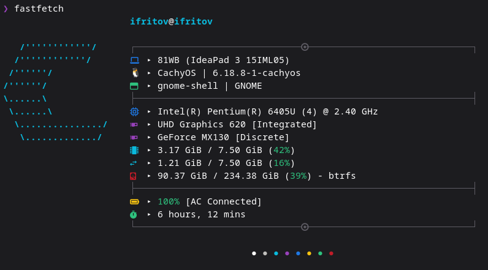

# 🚀 ifritov-fastfetch

## 🛠 Installation

### 1. Requirements
Ensure you have [Fastfetch](https://github.com/fastfetch-cli/fastfetch) installed.

### 2. Setup
* **Generate config:** If you haven't used Fastfetch before, run `fastfetch --gen-config` to create the necessary folders.
* **Download:** Download my `config.jsonc` file from this repository.
* **Replace:** Just replace the default config file at `~/.config/fastfetch/config.jsonc` with my version. 

**⚠️ If icons are not displaying correctly, the problem is with the font selected in your terminal. Use any **Nerd Font** to see them.**

## ⭐ If you like this config, please give it a star!
